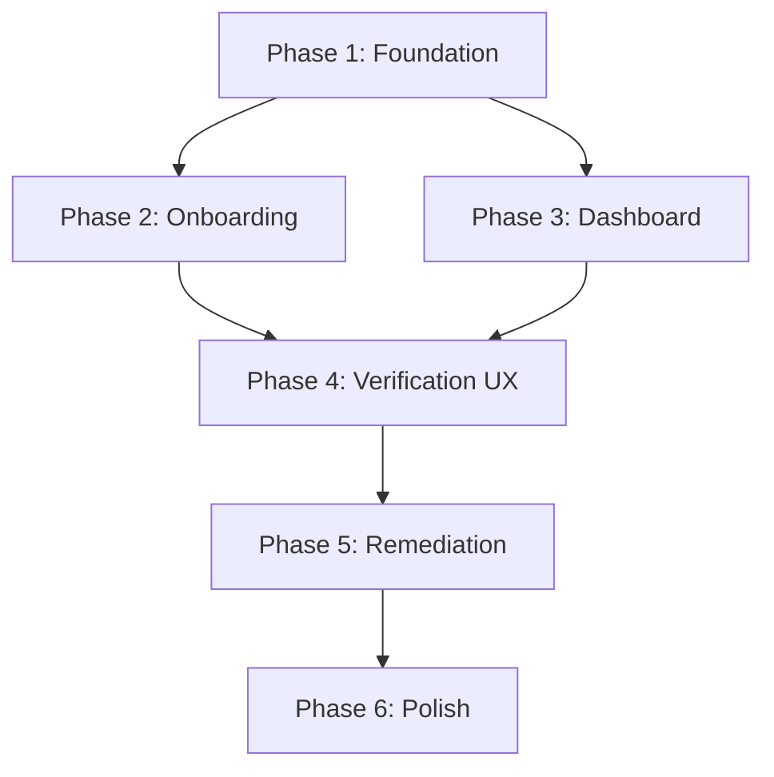

# CVA UI Development Plan

> **Canonical note (2025-12-18):** This document is now **superseded** by the repository-level execution artifact: `INVARIANT_UI_EXECUTION_ARTIFACT.md`.
>
> Keep this file for historical detail and long-form UX ideation, but treat the artifact as the source of truth for what exists vs what to build next.

> **Comprehensive Sequential Implementation Plan for Vibecoder-Focused UI**
>
> Version: 1.0 | Created: December 17, 2025

---

## Table of Contents

1. [System Overview](#1-system-overview)
2. [Architecture Decisions](#2-architecture-decisions)
3. [Development Phases](#3-development-phases)
4. [Phase 1: Foundation & Refactoring](#4-phase-1-foundation--refactoring)
5. [Phase 2: Onboarding System](#5-phase-2-onboarding-system)
6. [Phase 3: Project Dashboard](#6-phase-3-project-dashboard)
7. [Phase 4: Enhanced Verification UX](#7-phase-4-enhanced-verification-ux)
8. [Phase 5: One-Click Remediation](#8-phase-5-one-click-remediation)
9. [Phase 6: Polish & Delight](#9-phase-6-polish--delight)
10. [Testing Strategy](#10-testing-strategy)
11. [Dependencies & Risks](#11-dependencies--risks)
12. [Verification Checklist](#12-verification-checklist)

---

## 1. System Overview

### 1.1 What We're Building

A **vibecoder-optimized UI** for the Consensus Verifier Agent (CVA) that transforms complex code verification into an intuitive, delightful experience. The goal is to help users who rely on AI for code generation understand whether their code works correctly.

### 1.2 Target User: The Vibecoder

**Definition:** A developer who uses AI tools (ChatGPT, Copilot, Claude) to generate code and needs verification that the code works as intended.

**Key Characteristics:**
- Non-traditional programming background (may not have CS degree)
- Describes desired behavior in plain English
- Values speed over perfection
- Wants clear pass/fail results, not technical jargon
- Solo developers or small teams
- Often working on side projects, MVPs, or indie products

**User Research Insights (from Appcues best practices):**
1. **40-60% of SaaS users sign up once and never return** - onboarding is critical
2. **"Aha moment" must come quickly** - show value before asking for investment
3. **Personalization increases retention** - tailor experience to user goals
4. **Checklists leverage psychology** - Zeigarnik effect drives completion
5. **Progressive disclosure** - don't overwhelm with complexity upfront

### 1.3 Current State Assessment

| Component | Lines | Complexity | Refactoring Need |
|-----------|-------|------------|------------------|
| `app/page.tsx` | n/a (modularized) | Medium | 🟢 None |
| `components/Verdict.tsx` | ~250 | Medium | 🟢 Low |
| `components/PatchDiff.tsx` | ~100 | Low | 🟢 None |
| `lib/types.ts` | 282 | Low | 🟢 None |
| `lib/api.ts` | ~100 | Low | 🟢 None |
| `app/analytics/page.tsx` | n/a (uses `components/analytics/*`) | Medium | 🟡 Medium |

**Current Tech Stack:**
- Next.js 14 (App Router)
- TypeScript
- Tailwind CSS (dark theme)
- NextAuth (Google + GitHub OAuth)
- WebSocket + HTTP polling fallback
- Jest for testing

---

## 2. Architecture Decisions

### 2.1 Component Architecture

**Decision: Atomic Design with Feature-Based Organization**

```
dysruption-ui/
├── app/                          # Next.js App Router pages
│   ├── (auth)/                   # Auth-related routes (login, callback)
│   │   └── login/
│   ├── (onboarding)/             # Onboarding wizard routes
│   │   └── welcome/
│   ├── (dashboard)/              # Main app routes (protected)
│   │   ├── page.tsx              # Dashboard home (project list)
│   │   ├── projects/
│   │   │   └── [projectId]/
│   │   │       ├── page.tsx      # Single project view
│   │   │       └── runs/
│   │   │           └── [runId]/
│   │   │               └── page.tsx  # Run detail view
│   │   └── settings/
│   └── api/                      # API routes
├── components/
│   ├── ui/                       # Atomic UI components (shadcn-style)
│   │   ├── button.tsx
│   │   ├── card.tsx
│   │   ├── input.tsx
│   │   ├── select.tsx
│   │   ├── modal.tsx
│   │   ├── tooltip.tsx
│   │   ├── progress.tsx
│   │   ├── badge.tsx
│   │   └── index.ts              # Barrel export
│   ├── layout/                   # Layout components
│   │   ├── Navbar.tsx
│   │   ├── Sidebar.tsx
│   │   ├── Footer.tsx
│   │   └── CommandPalette.tsx
│   ├── features/                 # Feature-specific components
│   │   ├── onboarding/
│   │   │   ├── WelcomeWizard.tsx
│   │   │   ├── StepIndicator.tsx
│   │   │   ├── TemplateSelector.tsx
│   │   │   └── RepoSelector.tsx
│   │   ├── projects/
│   │   │   ├── ProjectCard.tsx
│   │   │   ├── ProjectList.tsx
│   │   │   └── ProjectHeader.tsx
│   │   ├── verification/
│   │   │   ├── VerifyButton.tsx
│   │   │   ├── ProgressPanel.tsx
│   │   │   ├── JudgeCards.tsx
│   │   │   └── ResultSummary.tsx
│   │   ├── remediation/
│   │   │   ├── IssueList.tsx
│   │   │   ├── FixPreview.tsx
│   │   │   └── ApplyButton.tsx
│   │   └── analytics/
│   │       ├── TrendChart.tsx
│   │       ├── KPICard.tsx
│   │       └── VerdictDonut.tsx
│   └── shared/                   # Shared components
│       ├── Toast.tsx
│       ├── Confetti.tsx
│       ├── LoadingSpinner.tsx
│       └── ErrorBoundary.tsx
├── lib/
│   ├── api.ts                    # API client
│   ├── ws.ts                     # WebSocket client
│   ├── types.ts                  # TypeScript interfaces
│   ├── hooks/                    # Custom React hooks
│   │   ├── useVerification.ts
│   │   ├── useProjects.ts
│   │   ├── useKeyboardShortcuts.ts
│   │   └── useOnboarding.ts
│   └── stores/                   # Zustand stores
│       ├── verificationStore.ts
│       ├── projectStore.ts
│       └── uiStore.ts
├── styles/
│   ├── globals.css
│   └── tokens.css                # Design tokens
└── public/
    ├── templates/                # Spec templates (JSON)
    └── animations/               # Lottie/JSON animations
```

### 2.2 State Management

**Decision: Zustand for Global State + React Query for Server State**

```typescript
// lib/stores/verificationStore.ts
import { create } from 'zustand';
import { subscribeWithSelector } from 'zustand/middleware';

interface VerificationState {
  // State
  status: PipelineStatus;
  progress: number;
  currentRunId: string | null;
  consensus: ConsensusResult | null;
  
  // Actions
  startRun: (projectId: string, spec: string) => Promise<void>;
  cancelRun: () => Promise<void>;
  reset: () => void;
}
```

**Rationale:**
- Zustand is lightweight (1kb), simple API, no boilerplate
- React Query handles caching, refetching, optimistic updates
- Clear separation: Zustand for UI state, React Query for server state

### 2.3 Design System Tokens

**Decision: CSS Custom Properties with Tailwind Extension**

```css
/* styles/tokens.css */
:root {
  /* Semantic Colors */
  --color-success: #22c55e;
  --color-warning: #eab308;
  --color-danger: #ef4444;
  --color-primary: #6366f1;
  
  /* Verdict Colors */
  --color-pass: var(--color-success);
  --color-fail: var(--color-danger);
  --color-veto: #dc2626;
  --color-partial: var(--color-warning);
  
  /* Judge Colors */
  --color-architect: #8b5cf6;
  --color-security: #ef4444;
  --color-user-proxy: #3b82f6;
  
  /* Surface Colors */
  --color-bg: #0a0a0a;
  --color-surface-1: #171717;
  --color-surface-2: #262626;
  --color-surface-3: #404040;
  --color-border: #404040;
  
  /* Typography */
  --font-sans: 'Inter', system-ui, sans-serif;
  --font-mono: 'JetBrains Mono', monospace;
  
  /* Spacing */
  --space-1: 0.25rem;
  --space-2: 0.5rem;
  --space-3: 0.75rem;
  --space-4: 1rem;
  --space-6: 1.5rem;
  --space-8: 2rem;
  
  /* Radii */
  --radius-sm: 0.25rem;
  --radius-md: 0.5rem;
  --radius-lg: 0.75rem;
  --radius-xl: 1rem;
  
  /* Shadows */
  --shadow-sm: 0 1px 2px rgba(0, 0, 0, 0.4);
  --shadow-md: 0 4px 6px rgba(0, 0, 0, 0.5);
  --shadow-lg: 0 10px 15px rgba(0, 0, 0, 0.6);
}
```

---

## 3. Development Phases

### Overview Timeline

```
Week 1-2:   Phase 1 - Foundation & Refactoring
Week 3-4:   Phase 2 - Onboarding System
Week 5-6:   Phase 3 - Project Dashboard
Week 7-8:   Phase 4 - Enhanced Verification UX
Week 9-10:  Phase 5 - One-Click Remediation
Week 11-12: Phase 6 - Polish & Delight
```

### Phase Dependencies



---

## 4. Phase 1: Foundation & Refactoring

### 4.1 Objective

Refactor the monolithic `page.tsx` into modular, testable components and establish the design system foundation.

### 4.2 Tasks

#### Task 1.1: Create Design Tokens

**Description:** Establish CSS custom properties for consistent theming.

**Deliverables:**
- [ ] Create `styles/tokens.css` with color, spacing, typography tokens
- [ ] Update `tailwind.config.ts` to reference CSS variables
- [ ] Update `globals.css` to import tokens

**Verification:**
- [ ] All existing colors are mapped to tokens
- [ ] Tailwind classes like `bg-surface-1` work correctly
- [ ] No hardcoded color values in components

**Acceptance Criteria:**
```typescript
// tailwind.config.ts should include:
colors: {
  success: 'var(--color-success)',
  danger: 'var(--color-danger)',
  surface: {
    1: 'var(--color-surface-1)',
    2: 'var(--color-surface-2)',
    3: 'var(--color-surface-3)',
  }
}
```

---

#### Task 1.2: Create Base UI Components

**Description:** Extract atomic UI components following shadcn/ui patterns.

**Components to Create:**

| Component | Props | Description |
|-----------|-------|-------------|
| `Button` | variant, size, loading, disabled | Primary action button |
| `Card` | className, children | Container with consistent styling |
| `Input` | label, error, placeholder | Text input with validation |
| `Select` | options, value, onChange | Dropdown select |
| `Badge` | variant (success/danger/warning) | Status indicator |
| `Progress` | value, max, showLabel | Progress bar |
| `Modal` | open, onClose, title | Dialog overlay |
| `Tooltip` | content, children | Hover information |

**Verification:**
- [ ] Each component has TypeScript props interface
- [ ] Each component has at least 3 unit tests
- [ ] Components follow accessibility guidelines (ARIA)
- [ ] Components support keyboard navigation

**Example Implementation:**
```typescript
// components/ui/button.tsx
import { cva, type VariantProps } from 'class-variance-authority';
import { Loader2 } from 'lucide-react';

const buttonVariants = cva(
  'inline-flex items-center justify-center rounded-md font-medium transition-colors focus-visible:outline-none focus-visible:ring-2 disabled:pointer-events-none disabled:opacity-50',
  {
    variants: {
      variant: {
        primary: 'bg-primary text-white hover:bg-primary/90',
        secondary: 'bg-surface-2 text-white hover:bg-surface-3',
        danger: 'bg-danger text-white hover:bg-danger/90',
        ghost: 'hover:bg-surface-2',
      },
      size: {
        sm: 'h-8 px-3 text-sm',
        md: 'h-10 px-4',
        lg: 'h-12 px-6 text-lg',
      },
    },
    defaultVariants: {
      variant: 'primary',
      size: 'md',
    },
  }
);

interface ButtonProps
  extends React.ButtonHTMLAttributes<HTMLButtonElement>,
    VariantProps<typeof buttonVariants> {
  loading?: boolean;
}

export function Button({ 
  variant, 
  size, 
  loading, 
  disabled, 
  children, 
  ...props 
}: ButtonProps) {
  return (
    <button
      className={buttonVariants({ variant, size })}
      disabled={disabled || loading}
      {...props}
    >
      {loading && <Loader2 className="mr-2 h-4 w-4 animate-spin" />}
      {children}
    </button>
  );
}
```

---

#### Task 1.3: Extract Feature Components from page.tsx

**Description:** Completed. The dashboard route is split into feature components under `components/dashboard/*`, with orchestration logic in `components/dashboard/useCvaRunController.ts`.

**Current component layout:**

| Feature | Component | Location |
|---|---|---|
| Header actions + auth | `DashboardHeader` | `components/dashboard/DashboardHeader.tsx` |
| Run history selection | `RunHistoryDropdown` | `components/dashboard/RunHistoryDropdown.tsx` |
| Start/config controls | `PrimaryActionPanel` | `components/dashboard/PrimaryActionPanel.tsx` |
| Progress + downloads | `ProgressResultsPanel` | `components/dashboard/ProgressResultsPanel.tsx` |
| Verdicts + patches + prompt | `ResultsSection` | `components/dashboard/ResultsSection.tsx` |
| Orchestration + state | `useCvaRunController` | `components/dashboard/useCvaRunController.ts` |

**Verification:**
- [x] Dashboard UI extracted into feature components
- [ ] All feature components have dedicated test files
- [ ] No regressions in existing functionality
- [x] All TypeScript types maintained

**Test Command:**
```bash
npm run test -- --coverage --watchAll=false
```

---

#### Task 1.4: Install State Management Dependencies

**Description:** Add Zustand and React Query for state management.

**Commands:**
```bash
npm install zustand @tanstack/react-query
```

**Deliverables:**
- [ ] Create `lib/stores/verificationStore.ts`
- [ ] Create `lib/stores/projectStore.ts`
- [ ] Create `lib/stores/uiStore.ts`
- [ ] Create `app/providers.tsx` with QueryClientProvider
- [ ] Migrate relevant useState to Zustand

**Verification:**
- [ ] State persists across page navigations
- [ ] React Query caches API responses
- [ ] No duplicate API calls on mount

---

#### Task 1.5: Create Test Infrastructure

**Description:** Set up comprehensive testing for all components.

**Deliverables:**
- [ ] Configure Jest for component testing
- [ ] Create test utilities (render with providers, mock API)
- [ ] Add MSW for API mocking
- [ ] Create snapshot tests for UI components

**Test Categories:**

| Category | Tools | Coverage Target |
|----------|-------|-----------------|
| Unit Tests | Jest + React Testing Library | 80% |
| Component Tests | Jest + RTL | 90% for UI components |
| Integration Tests | Jest + MSW | Key user flows |
| E2E Tests | Playwright (future) | Critical paths |

---

### 4.3 Phase 1 Verification Checklist

- [ ] `styles/tokens.css` created with all design tokens
- [ ] 8 atomic UI components created (`Button`, `Card`, `Input`, `Select`, `Badge`, `Progress`, `Modal`, `Tooltip`)
- [ ] Each UI component has TypeScript props + tests
- [ ] `page.tsx` refactored to <200 lines
- [ ] 6 feature components extracted
- [ ] 3 custom hooks created (`useVerification`, `useGitHubRepos`, `useWebSocket`)
- [ ] Zustand stores created for verification, projects, UI
- [ ] React Query provider configured
- [ ] All existing tests passing
- [ ] New test coverage >80%

---

## 5. Phase 2: Onboarding System

### 5.1 Objective

Create a 3-step onboarding wizard that guides new users to their first successful verification, achieving "aha moment" within 5 minutes.

### 5.2 Research Insights (Applied)

From Appcues best practices:

1. **Know your customers** - We target vibecoders specifically
2. **Tailor the experience** - Offer templates based on project type
3. **Provide quick wins** - First verification should succeed
4. **Clear path to "Aha"** - Minimize steps to first result
5. **Use progress indicators** - Checklists leverage Zeigarnik effect

### 5.3 Tasks

#### Task 2.1: Create Onboarding State Management

**Description:** Track onboarding progress in Zustand + localStorage.

**Deliverables:**
```typescript
// lib/stores/onboardingStore.ts
interface OnboardingState {
  isComplete: boolean;
  currentStep: number;
  steps: {
    githubConnected: boolean;
    repoSelected: boolean;
    specCreated: boolean;
    firstRunComplete: boolean;
  };
  selectedRepo: string | null;
  selectedTemplate: string | null;
  
  // Actions
  setStep: (step: number) => void;
  markStepComplete: (step: keyof OnboardingState['steps']) => void;
  completeOnboarding: () => void;
  resetOnboarding: () => void;
}
```

**Verification:**
- [ ] State persists in localStorage
- [ ] New users see onboarding, returning users skip
- [ ] Clear mechanism to restart onboarding

---

#### Task 2.2: Create Onboarding Layout

**Description:** Full-screen wizard layout with step indicator.

**Deliverables:**
- [ ] `app/(onboarding)/layout.tsx` - Clean, centered layout
- [ ] `components/features/onboarding/StepIndicator.tsx` - Progress dots
- [ ] `components/features/onboarding/OnboardingCard.tsx` - Wrapper

**Mockup:**
```
┌─────────────────────────────────────────────────────────────┐
│                                                             │
│                        🛡️ INVARIANT                        │
│                                                             │
│           Let's verify your code is working right           │
│                                                             │
│  ┌───────────────────────────────────────────────────────┐  │
│  │                                                       │  │
│  │                  [ Step Content ]                     │  │
│  │                                                       │  │
│  └───────────────────────────────────────────────────────┘  │
│                                                             │
│                        ● ○ ○                               │
│                      Step 1 of 3                            │
│                                                             │
└─────────────────────────────────────────────────────────────┘
```

**Verification:**
- [ ] Responsive on mobile
- [ ] Step indicator shows current step
- [ ] Smooth transitions between steps

---

#### Task 2.3: Create Step 1 - Connect GitHub

**Description:** GitHub OAuth connection with clear value proposition.

**File:** `app/(onboarding)/welcome/page.tsx`

**Content:**
- Headline: "Connect Your Code"
- Subhead: "We'll access your repos to verify your code works as intended"
- Single CTA: "Connect GitHub"
- Skip option for demo mode

**Verification:**
- [ ] GitHub OAuth flow works
- [ ] Error handling for denied permissions
- [ ] Loading state during auth
- [ ] Redirect to Step 2 on success

---

#### Task 2.4: Create Step 2 - Select Repository

**Description:** Repository picker with search and language detection.

**File:** `app/(onboarding)/welcome/repo/page.tsx`

**Features:**
- Search/filter repos
- Show language badges (Python, TypeScript, etc.)
- Show last updated date
- Select single repo to continue

**Verification:**
- [ ] Repos load with pagination
- [ ] Search filters in real-time
- [ ] Selected repo persists in store
- [ ] "Continue" button enabled only when repo selected

---

#### Task 2.5: Create Step 3 - Describe Your Code

**Description:** Spec input with templates and plain English guidance.

**File:** `app/(onboarding)/welcome/spec/page.tsx`

**Features:**
- Template selector buttons:
  - Web API
  - CLI Tool
  - Data Pipeline
  - Mobile App
  - Custom
- Pre-populated spec based on template
- Plain English guidance
- "Start Verification" CTA

**Templates to Create:**
```typescript
// public/templates/spec-templates.json
{
  "web-api": {
    "name": "Web API",
    "icon": "🌐",
    "template": "This is a REST API that:\n- Handles user authentication\n- Stores data in a database\n- Returns JSON responses\n\nSecurity requirements:\n- No SQL injection vulnerabilities\n- Passwords must be hashed\n- Input validation on all endpoints"
  },
  "cli-tool": {
    "name": "CLI Tool",
    "icon": "⌨️",
    "template": "This is a command-line tool that:\n- Accepts arguments and flags\n- Processes files or data\n- Outputs results to stdout\n\nRequirements:\n- Handle errors gracefully\n- Validate all inputs\n- Provide helpful error messages"
  }
  // ... more templates
}
```

**Verification:**
- [ ] Templates load and populate textarea
- [ ] Custom editing works
- [ ] Spec validation (min length, required fields)
- [ ] First verification runs on submit

---

#### Task 2.6: Create First-Run Success Screen

**Description:** Celebration screen after first successful verification.

**Features:**
- Confetti animation
- "You did it!" message
- Score display
- "Go to Dashboard" CTA
- Mark onboarding complete

**Verification:**
- [ ] Confetti plays on success
- [ ] Onboarding marked complete in store
- [ ] User redirected to dashboard
- [ ] Won't show onboarding again

---

### 5.4 Phase 2 Verification Checklist

- [ ] Onboarding store with persistence
- [ ] 3-step wizard flow implemented
- [ ] GitHub connection in Step 1
- [ ] Repository selection in Step 2
- [ ] Spec templates in Step 3
- [ ] First verification runs from onboarding
- [ ] Celebration screen on success
- [ ] Returning users skip to dashboard
- [ ] Mobile responsive
- [ ] All tests passing

---

## 6. Phase 3: Project Dashboard

### 6.1 Objective

Create a multi-project dashboard that provides at-a-glance health status for all verified projects.

### 6.2 Tasks

#### Task 3.1: Create Project Data Model

**Description:** Define project structure and API endpoints.

**Backend API (required):**
```python
# GET /api/projects
# Returns list of user's projects

# POST /api/projects
# Create new project

# GET /api/projects/{id}
# Get single project with runs

# DELETE /api/projects/{id}
# Delete project
```

**Frontend Types:**
```typescript
// lib/types.ts additions
interface Project {
  id: string;
  name: string;
  repo_full_name: string;
  branch: string;
  spec_summary: string;
  last_run_at: string | null;
  last_run_status: VerdictStatus | null;
  last_run_score: number | null;
  total_runs: number;
  created_at: string;
}
```

**Verification:**
- [ ] Backend endpoints exist and work
- [ ] Frontend types match backend response
- [ ] React Query fetches and caches projects

---

#### Task 3.2: Create Dashboard Layout

**Description:** Main dashboard page structure.

**File:** `app/(dashboard)/page.tsx`

**Layout:**
```
┌─────────────────────────────────────────────────────────────┐
│ 🛡️ INVARIANT           [Search] ⌘K     🔔  ⚙️  [Avatar]    │
├─────────────────────────────────────────────────────────────┤
│                                                             │
│  Welcome back, Alex! 3 projects verified today ✨           │
│                                                             │
│  Your Projects                               [+ New Project]│
│  ┌─────────────┐ ┌─────────────┐ ┌─────────────┐           │
│  │ ProjectCard │ │ ProjectCard │ │ ProjectCard │           │
│  └─────────────┘ └─────────────┘ └─────────────┘           │
│                                                             │
│  This Week                                                  │
│  ┌─────────────────────────────────────────────────────────┐│
│  │ 12 runs │ 8 passed │ 4 need attention │ ↑15% better    ││
│  └─────────────────────────────────────────────────────────┘│
└─────────────────────────────────────────────────────────────┘
```

**Verification:**
- [ ] Projects load on mount
- [ ] Empty state for no projects
- [ ] Loading skeleton shown
- [ ] Error handling for API failure

---

#### Task 3.3: Create ProjectCard Component

**Description:** Card showing project health at a glance.

**Props:**
```typescript
interface ProjectCardProps {
  project: Project;
  onVerify: () => void;
  onView: () => void;
}
```

**Visual States:**
| State | Color | Icon | Message |
|-------|-------|------|---------|
| Healthy (pass) | Green | ✅ | "All checks passing" |
| Issues (fail) | Red | ❌ | "3 issues found" |
| Verifying | Yellow | 🔄 | "Verifying... 67%" |
| Never verified | Gray | ⚪ | "Not yet verified" |

**Verification:**
- [ ] All 4 states render correctly
- [ ] Click navigates to project detail
- [ ] Verify button triggers run
- [ ] Responsive on mobile

---

#### Task 3.4: Create Command Palette

**Description:** ⌘K quick actions menu.

**File:** `components/layout/CommandPalette.tsx`

**Actions:**
- Search projects
- Create new project
- Run verification
- Open settings
- View analytics
- Sign out

**Implementation:**
- Use Radix UI Dialog + Combobox
- Keyboard navigation
- Fuzzy search

**Verification:**
- [ ] ⌘K (Mac) / Ctrl+K (Windows) opens palette
- [ ] Escape closes
- [ ] Arrow keys navigate
- [ ] Enter selects

---

#### Task 3.5: Create Project Detail Page

**Description:** Single project view with run history.

**File:** `app/(dashboard)/projects/[projectId]/page.tsx`

**Sections:**
1. Project header (name, repo, branch, last verified)
2. Quick actions (Verify, View Spec, Settings, Trends)
3. Recent runs table
4. Score trend chart (30 days)

**Verification:**
- [ ] Project loads by ID
- [ ] Run history shows with pagination
- [ ] Chart renders with data
- [ ] Quick actions work

---

### 6.3 Phase 3 Verification Checklist

- [ ] Backend `/api/projects` endpoints work
- [ ] Dashboard page loads projects
- [ ] ProjectCard renders all states
- [ ] Command palette (⌘K) works
- [ ] Project detail page loads
- [ ] Run history with pagination
- [ ] Trend chart renders
- [ ] Empty states for no data
- [ ] Mobile responsive
- [ ] All tests passing

---

## 7. Phase 4: Enhanced Verification UX

### 7.1 Objective

Improve the verification experience with better progress feedback, plain English results, and enhanced judge visualization.

### 7.2 Tasks

#### Task 4.1: Create Enhanced Progress Panel

**Description:** More visual progress with stage labels and time estimates.

**Stages to Display:**
```typescript
const stages = [
  { key: 'scanning', label: 'Scanning files...', duration: '~10s' },
  { key: 'parsing', label: 'Understanding your code...', duration: '~5s' },
  { key: 'static_analysis', label: 'Quick quality check...', duration: '~15s' },
  { key: 'judging', label: 'AI judges reviewing...', duration: '~60s' },
  { key: 'patching', label: 'Generating fixes...', duration: '~20s' },
];
```

**Features:**
- Animated stage icons
- Estimated time remaining
- File count being analyzed
- Cancel button

**Verification:**
- [ ] Progress bar animates smoothly
- [ ] Stage labels update correctly
- [ ] Time estimates are reasonable
- [ ] Cancel actually stops run

---

#### Task 4.2: Create Plain English Result Summary

**Description:** Transform technical verdicts into vibecoder-friendly language.

**Language Mapping:**
```typescript
const verdictMessages = {
  pass: {
    headline: '🎉 Your code looks great!',
    subhead: 'All {judgeCount} AI judges approved your code.',
  },
  fail: {
    headline: '⚠️ Found some issues to fix',
    subhead: '{issueCount} issues need attention before shipping.',
  },
  veto: {
    headline: '🛑 Security issue detected',
    subhead: 'The security judge found a critical vulnerability.',
  },
};
```

**Verification:**
- [ ] Messages match verdict status
- [ ] Issue counts are accurate
- [ ] No technical jargon visible
- [ ] CTA buttons are clear (Fix Issues / View Details)

---

#### Task 4.3: Redesign Judge Cards

**Description:** Visual judge representation with personality.

**Judge Personas:**
| Judge | Emoji | Color | Personality |
|-------|-------|-------|-------------|
| Architect | 🏛️ | Purple | "Checks code structure and design" |
| Security | 🔒 | Red | "Guards against vulnerabilities" |
| User Proxy | 👤 | Blue | "Ensures code does what you asked" |

**Card Layout:**
```
┌─────────────────────┐
│  🏛️ Architect       │
│  Score: 9.2/10      │
│  ✅ Approved        │
│                     │
│  "Your code follows │
│   good patterns"    │
│                     │
│  [View Details ▼]   │
└─────────────────────┘
```

**Verification:**
- [ ] Each judge has distinct visual identity
- [ ] Scores display with appropriate colors
- [ ] Expandable details work
- [ ] Responsive layout

---

#### Task 4.4: Add Celebration Animation

**Description:** Confetti animation on successful verification.

**Implementation:**
```bash
npm install canvas-confetti
```

```typescript
// components/shared/Confetti.tsx
import confetti from 'canvas-confetti';

export function triggerConfetti() {
  confetti({
    particleCount: 100,
    spread: 70,
    origin: { y: 0.6 }
  });
}
```

**Verification:**
- [ ] Confetti triggers on pass
- [ ] No confetti on fail/veto
- [ ] Animation is performant
- [ ] Respects prefers-reduced-motion

---

### 7.3 Phase 4 Verification Checklist

- [ ] Enhanced progress panel with stages
- [ ] Time estimates during verification
- [ ] Plain English result messages
- [ ] Redesigned judge cards with personas
- [ ] Expandable issue details
- [ ] Confetti on success
- [ ] Respects reduced motion preference
- [ ] Mobile responsive
- [ ] All tests passing

---

## 8. Phase 5: One-Click Remediation

### 8.1 Objective

Enable users to apply AI-generated fixes directly to their GitHub repository with a single click.

### 8.2 Tasks

#### Task 5.1: Create Issue Priority System

**Description:** Rank issues by severity with visual indicators.

**Severity Levels:**
| Level | Color | Icon | Description |
|-------|-------|------|-------------|
| Critical | Red | 🔴 | Security vulnerabilities, data loss risks |
| High | Orange | 🟠 | Bugs that will break functionality |
| Medium | Yellow | 🟡 | Code quality issues |
| Low | Blue | 🔵 | Style, formatting, minor improvements |

**Verification:**
- [ ] Issues sorted by severity
- [ ] Visual indicators match severity
- [ ] Filter by severity works

---

#### Task 5.2: Create Fix Preview Component

**Description:** Side-by-side diff view with explanation.

**Layout:**
```
┌─────────────────────────────────────────────────────────────┐
│ 🔴 CRITICAL: SQL Injection in routes.py                     │
├─────────────────────────────────────────────────────────────┤
│                                                             │
│  Why this matters:                                          │
│  Your code uses string formatting to build SQL queries.     │
│  This allows attackers to inject malicious SQL.             │
│                                                             │
│  ┌─────────────────────┐ ┌─────────────────────┐           │
│  │ Before              │ │ After               │           │
│  │                     │ │                     │           │
│  │ query = f"SELECT    │ │ query = "SELECT     │           │
│  │   * FROM {table}"   │ │   * FROM users      │           │
│  │                     │ │   WHERE id = %s"    │           │
│  └─────────────────────┘ └─────────────────────┘           │
│                                                             │
│  [✅ Apply This Fix]  [❌ Skip]  [📋 Copy]                  │
│                                                             │
└─────────────────────────────────────────────────────────────┘
```

**Verification:**
- [ ] Side-by-side diff renders correctly
- [ ] Syntax highlighting works
- [ ] Copy to clipboard works
- [ ] Skip remembers choice

---

#### Task 5.3: Implement Apply Fix API

**Description:** Backend endpoint to apply patch to GitHub.

**Backend API (required):**
```python
# POST /api/projects/{id}/apply-fix
# Body: { run_id: str, patch_index: int }
# 
# Actions:
# 1. Fetch patch from run artifacts
# 2. Create branch (fix/{run_id}-{timestamp})
# 3. Apply patch via GitHub API
# 4. Create PR
# 5. Return PR URL
```

**Frontend Integration:**
```typescript
// lib/api.ts
export async function applyFix(
  projectId: string, 
  runId: string, 
  patchIndex: number
): Promise<{ pr_url: string }> {
  const response = await fetch(`/api/projects/${projectId}/apply-fix`, {
    method: 'POST',
    body: JSON.stringify({ run_id: runId, patch_index: patchIndex }),
  });
  return response.json();
}
```

**Verification:**
- [ ] Apply creates branch
- [ ] Patch is committed correctly
- [ ] PR is created with description
- [ ] User receives PR URL

---

#### Task 5.4: Create Apply All Button

**Description:** Apply all fixes in a single action.

**Flow:**
1. User clicks "Apply All Fixes"
2. Confirmation modal: "This will create a PR with X fixes"
3. Loading state: "Creating PR..."
4. Success: "PR created! View on GitHub"

**Verification:**
- [ ] Confirmation required before applying
- [ ] All patches applied in single commit
- [ ] PR description lists all fixes
- [ ] Error handling for conflicts

---

### 8.3 Phase 5 Verification Checklist

- [ ] Issue priority system implemented
- [ ] Side-by-side diff preview
- [ ] Single fix application works
- [ ] Apply all fixes works
- [ ] PR created on GitHub
- [ ] PR description is clear
- [ ] Error handling for failures
- [ ] Mobile responsive
- [ ] All tests passing

---

## 9. Phase 6: Polish & Delight

### 9.1 Objective

Add finishing touches that make the UI feel delightful and professional.

### 9.2 Tasks

#### Task 6.1: Keyboard Shortcuts System

**Shortcuts to Implement:**
| Shortcut | Action |
|----------|--------|
| `⌘K` / `Ctrl+K` | Open command palette |
| `⌘Enter` | Run verification |
| `Escape` | Close modals |
| `?` | Show shortcuts help |
| `g h` | Go to dashboard |
| `g s` | Go to settings |

**Verification:**
- [ ] All shortcuts work on Mac
- [ ] All shortcuts work on Windows
- [ ] Help modal shows all shortcuts
- [ ] Shortcuts don't conflict with browser

---

#### Task 6.2: Toast Notification System

**Description:** Non-blocking notifications for actions.

**Types:**
| Type | Icon | Duration | Example |
|------|------|----------|---------|
| Success | ✅ | 3s | "Verification complete!" |
| Error | ❌ | 5s | "Failed to connect to GitHub" |
| Info | ℹ️ | 3s | "Verification started" |
| Warning | ⚠️ | 5s | "1 issue needs attention" |

**Verification:**
- [ ] Toasts stack correctly
- [ ] Auto-dismiss works
- [ ] Manual dismiss works
- [ ] Accessible (announced to screen readers)

---

#### Task 6.3: Mobile Optimization

**Breakpoints:**
| Breakpoint | Width | Layout Changes |
|------------|-------|----------------|
| Mobile | <640px | Single column, stacked cards |
| Tablet | 640-1024px | 2 column grid |
| Desktop | >1024px | Full layout with sidebar |

**Mobile-Specific:**
- Touch-friendly buttons (min 44x44px)
- Swipe gestures for cards
- Bottom sheet modals
- Simplified navigation

**Verification:**
- [ ] All pages work on iPhone SE
- [ ] All pages work on iPad
- [ ] Touch targets are large enough
- [ ] No horizontal scrolling

---

#### Task 6.4: Loading States

**Description:** Consistent loading skeletons throughout.

**Components:**
- `ProjectCardSkeleton`
- `ResultSummarySkeleton`
- `JudgeCardSkeleton`
- `TableRowSkeleton`

**Verification:**
- [ ] Skeletons match final layout
- [ ] Animation is subtle
- [ ] No layout shift on load

---

#### Task 6.5: Error Boundaries

**Description:** Graceful error handling with recovery options.

**Error UI:**
```
┌─────────────────────────────────────────────────────────────┐
│                                                             │
│                    😕 Something went wrong                  │
│                                                             │
│   We couldn't load your projects. This might be a          │
│   temporary issue.                                          │
│                                                             │
│   [Try Again]  [Go Home]  [Contact Support]                │
│                                                             │
└─────────────────────────────────────────────────────────────┘
```

**Verification:**
- [ ] Errors are caught and displayed
- [ ] Retry button works
- [ ] Error details logged for debugging
- [ ] User can recover without refresh

---

### 9.3 Phase 6 Verification Checklist

- [ ] All keyboard shortcuts work
- [ ] Toast notifications work
- [ ] Mobile layouts optimized
- [ ] Loading skeletons added
- [ ] Error boundaries implemented
- [ ] Animations respect reduced motion
- [ ] Accessibility audit passed
- [ ] Performance audit passed (Lighthouse >90)
- [ ] All tests passing

---

## 10. Testing Strategy

### 10.1 Test Pyramid

```
         /\
        /E2E\         5% - Critical user flows
       /------\
      / Integration \ 20% - API + component integration
     /----------------\
    /    Component     \ 30% - React components
   /--------------------\
  /        Unit          \ 45% - Functions, hooks, utilities
 /------------------------\
```

### 10.2 Test Files Structure

```
__tests__/
├── unit/
│   ├── hooks/
│   │   ├── useVerification.test.ts
│   │   └── useProjects.test.ts
│   └── utils/
│       └── formatters.test.ts
├── components/
│   ├── ui/
│   │   ├── Button.test.tsx
│   │   └── Card.test.tsx
│   └── features/
│       ├── ProjectCard.test.tsx
│       └── JudgeCard.test.tsx
├── integration/
│   ├── verification-flow.test.tsx
│   └── project-creation.test.tsx
└── e2e/
    ├── onboarding.spec.ts
    └── verification.spec.ts
```

### 10.3 Coverage Targets

| Category | Target | Current |
|----------|--------|---------|
| Statements | 80% | TBD |
| Branches | 75% | TBD |
| Functions | 80% | TBD |
| Lines | 80% | TBD |

### 10.4 Test Commands

```bash
# Run all tests
npm test

# Run with coverage
npm run test:coverage

# Run specific test file
npm test -- Button.test.tsx

# Run in watch mode
npm test -- --watch

# Run E2E tests (future)
npm run test:e2e
```

---

## 11. Dependencies & Risks

### 11.1 External Dependencies

| Dependency | Required By | Risk Level | Mitigation |
|------------|-------------|------------|------------|
| Backend `/api/projects` | Phase 3 | 🟡 Medium | Can mock for frontend dev |
| Backend `/api/apply-fix` | Phase 5 | 🔴 High | Critical for remediation feature |
| GitHub API rate limits | All GitHub features | 🟡 Medium | Implement caching, backoff |
| WebSocket server | Real-time updates | 🟢 Low | HTTP polling fallback exists |

### 11.2 Technical Risks

| Risk | Probability | Impact | Mitigation |
|------|-------------|--------|------------|
| State management migration causes bugs | Medium | High | Comprehensive tests before migration |
| Performance regression with new components | Low | Medium | Lighthouse audits each phase |
| Breaking changes to backend API | Low | High | Version API endpoints |
| Browser compatibility issues | Low | Low | Target modern browsers only |

### 11.3 Timeline Risks

| Risk | Probability | Impact | Mitigation |
|------|-------------|--------|------------|
| Refactoring takes longer than expected | High | Medium | Phase 1 has buffer time |
| Backend API not ready for Phase 3 | Medium | High | Develop with mocks, integrate later |
| Design iterations slow progress | Medium | Medium | Lock designs before coding |

---

## 12. Verification Checklist

### Final Acceptance Criteria

#### Functional Requirements
- [ ] New users complete onboarding successfully
- [ ] Returning users see project dashboard
- [ ] Users can create new projects
- [ ] Users can run verification
- [ ] Users can view results in plain English
- [ ] Users can apply fixes to GitHub
- [ ] Users can navigate via command palette
- [ ] All features work on mobile

#### Non-Functional Requirements
- [ ] Page load time < 3s
- [ ] Lighthouse performance score > 90
- [ ] Lighthouse accessibility score > 95
- [ ] Test coverage > 80%
- [ ] No TypeScript errors
- [ ] No ESLint errors
- [ ] No console errors in production

#### User Experience
- [ ] "Aha moment" achievable in < 5 minutes
- [ ] No jargon visible to users
- [ ] All actions have clear feedback
- [ ] Errors are recoverable
- [ ] Keyboard navigation works throughout

---

## Appendix A: Quick Reference

### Commands

```bash
# Development
npm run dev              # Start dev server
npm test                 # Run tests
npm run test:coverage    # Run tests with coverage
npm run lint             # Run ESLint
npm run build            # Build for production

# Git workflow
git checkout -b feature/phase-1-tokens
git commit -m "feat: add design tokens"
git push origin feature/phase-1-tokens
```

### File Locations

| Purpose | Location |
|---------|----------|
| Design tokens | `styles/tokens.css` |
| UI components | `components/ui/` |
| Feature components | `components/features/` |
| Custom hooks | `lib/hooks/` |
| Zustand stores | `lib/stores/` |
| API client | `lib/api.ts` |
| Types | `lib/types.ts` |

### Key Contacts

| Role | Responsibility |
|------|----------------|
| Frontend Lead | UI implementation, component architecture |
| Backend Lead | API endpoints, GitHub integration |
| Product | Requirements, prioritization, user testing |
| Design | Mockups, design system, accessibility |

---

*Document Version: 1.0*
*Created: December 17, 2025*
*Last Updated: December 17, 2025*
